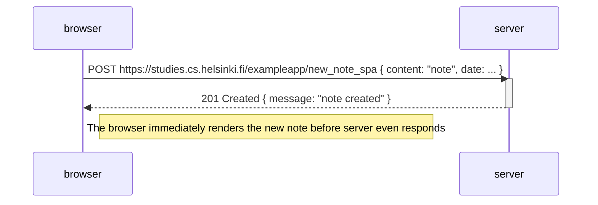

```mermaid
sequenceDiagram
    participant browser
    participant server
    
    browser->>server: POST https://studies.cs.helsinki.fi/exampleapp/new_note_spa { content: "note", date: ... }
    activate server
    server-->>browser: 201 Created { message: "note created" }
    deactivate server

    Note right of browser: The browser immediately renders the new note before server even responds
```